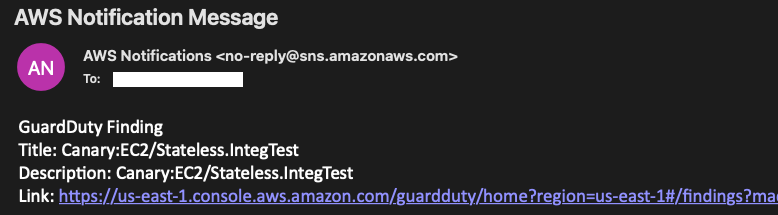

# Amazon GuardDuty findings to Mail Integration
## Overview

This repository contains an AWS CDK project to deploy a solution that automates the Amazon GuardDuty findings through mail using Amazon EventBridge, AWS Lambda and Amazon SNS. 
A sample of the notification can be seen below



## Architecture


## Getting started

To deploy this project in your account you can use either the available CloudFormation or execute directly from CDK

### CloudFormation

[CloudFormation Template](guardduty-to-sns.yaml)

### CDK
```
pip3 install -r requirements.txt
cdk deploy --parameters MailParameter=sample@my-org-sample.com
```

## Security

See [CONTRIBUTING](CONTRIBUTING.md#security-issue-notifications) for more information.

## License

This library is licensed under the MIT-0 License. See the LICENSE file.

